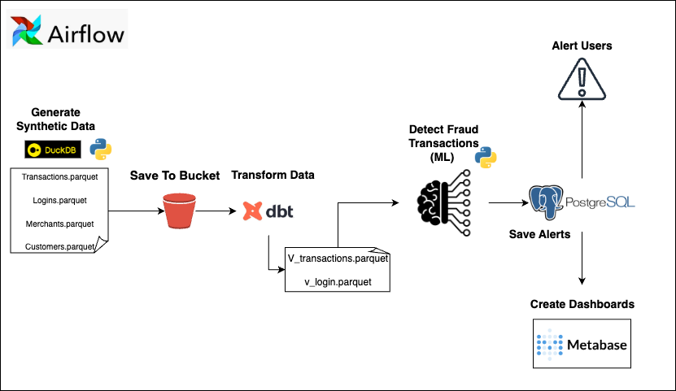

A complete, production-style fraud detection pipeline demonstrating modern data engineering best practices. From synthetic data generation to ML-powered fraud scoring and real-time dashboards—all orchestrated via Airflow and containerized for seamless deployment.

---

## 🎯 Project Overview

This project simulates a real-world financial fraud detection system, showcasing the full data lifecycle:

**📊 Data Journey:** Raw synthetic transactions → Partitioned storage → Dimensional models → ML scoring → Alert dashboards

**🔧 Tech Excellence:** Airflow orchestration with dataset-driven triggering, dbt dimensional modeling, hybrid rule-based + ML fraud detection, and automated Metabase visualization setup.

**🚀 Production Ready:** Comprehensive testing (44+ tests), CI/CD pipeline, security scanning, and fully containerized deployment.

---

## 🏗️ Project Structure

```
fraud-pipeline-patrol/
├── 📊 data/              # Raw synthetic data & partitioned outputs  
├── 🚦 airflow/           # Pipeline orchestration (6 DAGs, dataset-driven)
├── 🏗️ dbt/              # Dimensional models (Kimball methodology)
├── 🎯 scoring/           # ML fraud detection (rules + Random Forest)
├── 📈 metabase/          # Automated dashboard setup
├── 🧪 tests/            # 44+ comprehensive tests
└── 🐳 docker/           # Full containerization
```

**📖 Detailed Documentation:** Each module contains comprehensive READMEs with implementation details.

---


## 🧭 Architecture Diagram



## 🔄 How It Works

### 1. **🔢 Data Generation** ([`data/`](data/README.md))
- Generates realistic synthetic fraud data: customers, merchants, transactions, login attempts
- DuckDB partitions raw data for optimal downstream processing

### 2. **🚦 Pipeline Orchestration** ([`airflow/`](airflow/README.md))
- 6 interconnected DAGs triggered via Airflow Datasets
- Automated workflow: Data Generation → MinIO Upload → dbt Transform → ML Scoring → Alerts → Dashboards

### 3. **🏗️ Data Modeling** ([`dbt/`](dbt/README.md))
- Kimball dimensional modeling: Raw → Landing → Staging → Marts
- Star schema with enriched fact tables ready for analytics and ML

### 4. **🎯 Fraud Detection** ([`scoring/`](scoring/README.md))
- **Rule-based scoring:** Failed logins, geo-mismatches, night patterns, high-risk flags
- **ML model:** Random Forest achieving 97% precision/recall on engineered features
- Outputs fraud alerts to PostgreSQL for real-time monitoring

### 5. **📈 Visualization** ([`metabase/`](metabase/README.md))
- Automated Metabase setup: admin creation, database connections, dashboard imports
- Real-time fraud monitoring: risk distributions, top alerts, customer patterns

### 6. **✅ Quality Assurance** ([`tests/`](tests/README.md))
- 44+ comprehensive tests: unit, integration, DAG validation
- Automated CI/CD with security scanning and code quality checks

## ⚡ Quick Start

```bash
# 🚀 One-command setup
make setup

# 🧪 Run the complete test suite
make test

# 🐳 Launch the full pipeline
docker-compose up
```

**🔗 Need details?** Check out the module-specific READMEs linked above for deep-dive documentation.

---

## 🛠️ Tech Stack

| Component | Tools | Purpose |
|-----------|-------|---------|
| **Orchestration** | Airflow | Dataset-driven DAG workflows |
| **Data Modeling** | dbt, DuckDB | Kimball dimensional modeling |
| **Storage** | MinIO, PostgreSQL | Object storage & analytics DB |
| **ML & Scoring** | Python, scikit-learn | Hybrid fraud detection |
| **Visualization** | Metabase | Automated dashboards |
| **DevOps** | Docker, GitHub Actions | CI/CD & deployment |

---

## 👤 Author

**Karim Tarek** — Data & Analytics Engineer
📫 [LinkedIn](https://www.linkedin.com/in/karimtarek)
